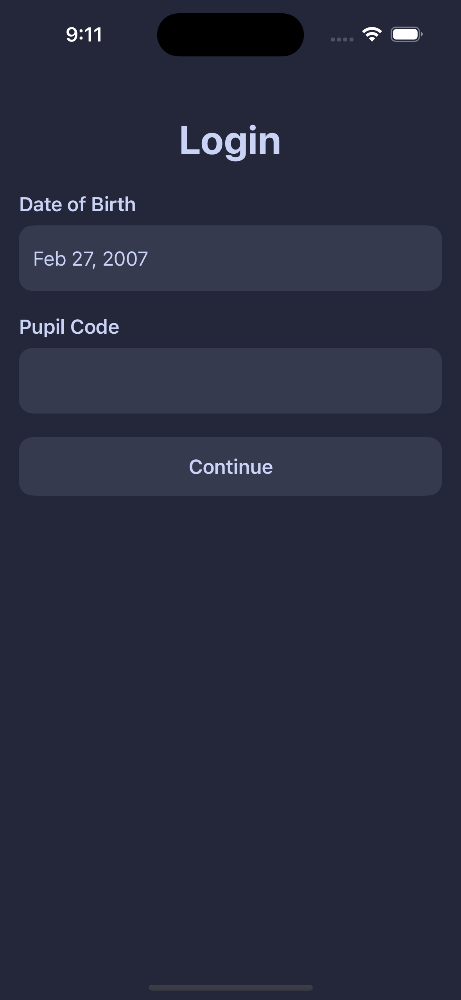
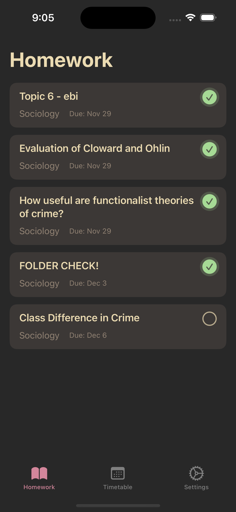
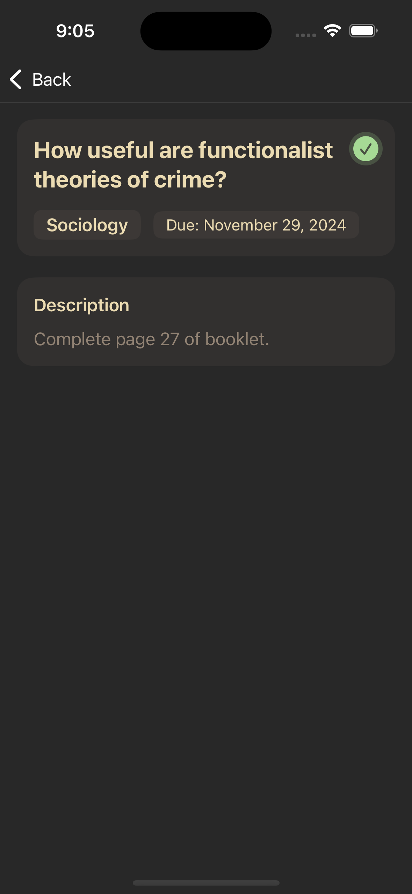
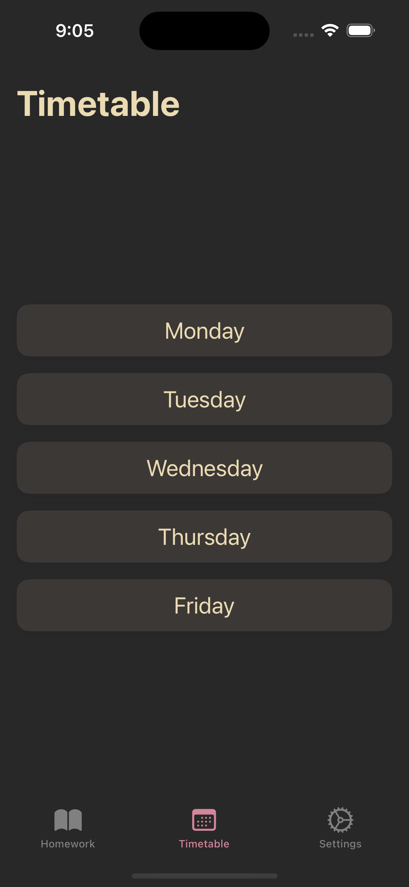
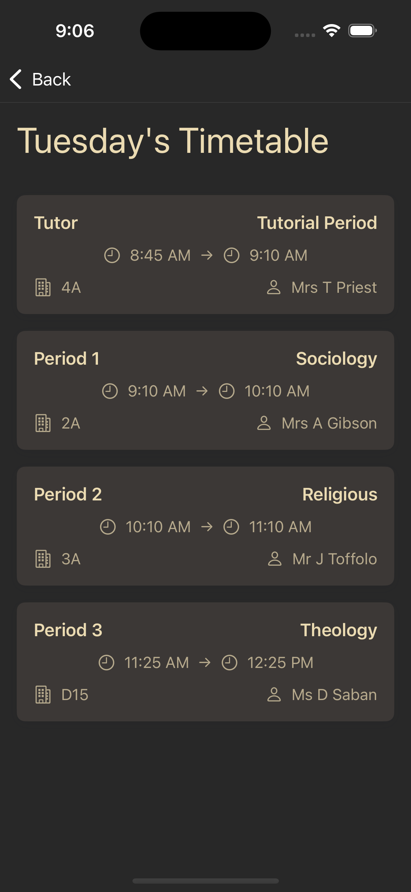
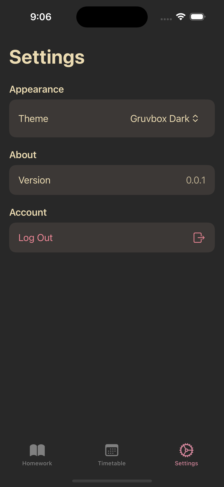
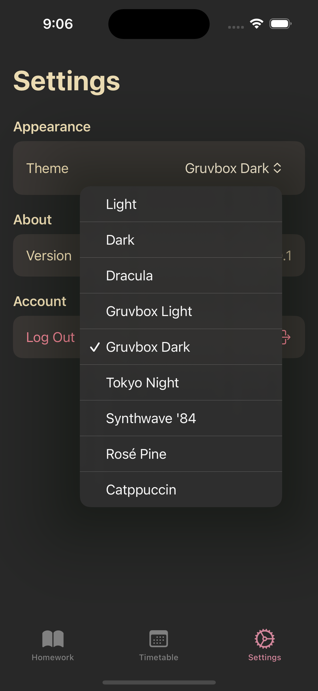
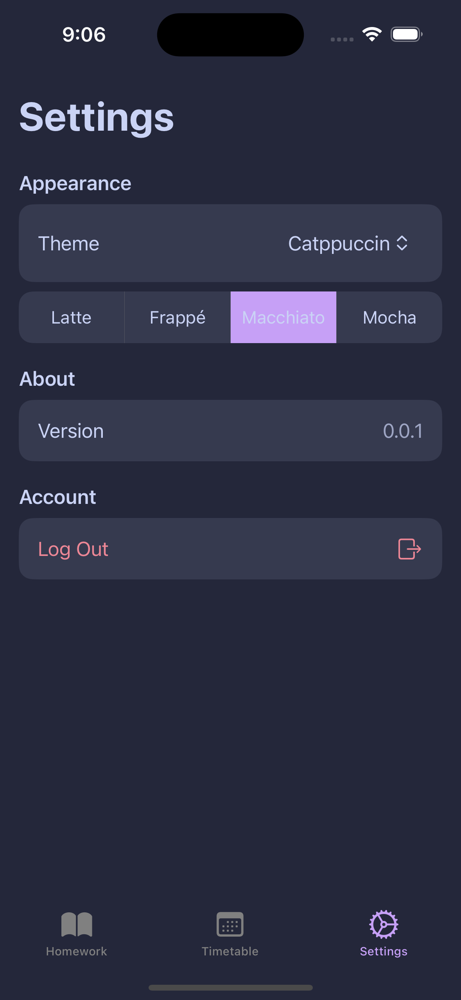

> **Archive Notice:** Hey there! This project is now **archived** as I've moved on to University and no longer use ClassCharts. While I can't actively maintain or provide support for the app anymore, feel free to fork the project and make it your own! I hope the code can be useful for others interested in building iOS apps in Swift or working with the ClassCharts API. Thanks for all the interest and support!

# BetterClasscharts

A modern, native iOS client for ClassCharts with multiple theme options.

## Features

- Native iOS app built with SwiftUI
- Multiple theme options including:
  - Light/Dark mode
  - Catppuccin (Latte, Frappé, Macchiato, Mocha)
  - Dracula
  - Gruvbox (Light/Dark)
  - Tokyo Night
  - Synthwave '84
  - Rosé Pine
- View homework assignments
- Mark homework as complete/incomplete
- View timetable day by day
- Pull to refresh homework list
- Session management

## Screenshots

Login Screen

Homework List

Homework Details

Timetable View

Timetable Day View

Settings

Theme Selection

Catppuccin Theme Settings

## Installation

### Option 1: Build from Source
1. Clone the repository
2. Open in Xcode
3. Build and run on your iOS device or simulator

### Option 2: Install Pre-built IPA
1. Download the latest IPA from the [Releases](../../releases) page
2. Install using AltStore, Sideloadly, or similar sideloading tool
3. Trust the app in Settings > General > Device Management
4. Note: You'll need to reinstall every 7 days due to free development limitations

## Usage

1. Launch the app
2. Enter your ClassCharts login details:
   - Date of Birth
   - Pupil Code
3. View your homework and timetable
4. Customize the appearance in Settings

## Requirements

- iOS 17.0 or later (may work on earlier versions but this is untested - your mileage may vary)
- Xcode 15.0 or later
- Valid ClassCharts account

## Technical Details

- Built with SwiftUI
- Uses URLSession for networking
- Implements proper error handling
- Automatic token refresh
- Secure credential storage using UserDefaults
- Environment-based theme management

## Contributing

Feel free to submit issues and enhancement requests!

## License

[Your chosen license]

## Acknowledgments

- Catppuccin Theme: https://github.com/catppuccin/catppuccin
- Dracula Theme: https://draculatheme.com
- Gruvbox Theme: https://github.com/morhetz/gruvbox
- Tokyo Night Theme: https://github.com/enkia/tokyo-night-vscode-theme
- Synthwave '84: https://github.com/robb0wen/synthwave-vscode
- Rosé Pine: https://rosepinetheme.com
- ClassCharts: https://classcharts.com
- Unofficial ClassCharts API Docs: https://classchartsapi.github.io/api-docs/

## Disclaimer

This is an unofficial client for ClassCharts and is not affiliated with or endorsed by ClassCharts or Tes. I cannot guarantee that it will work for you, or that it will continue to work in the future.